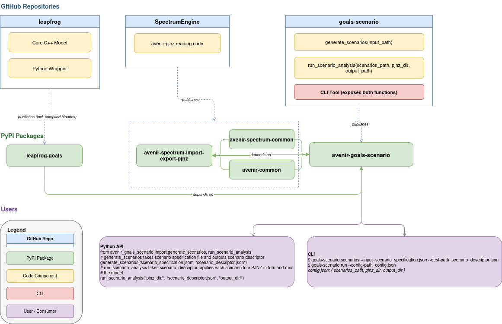

# goals-scenario

[](https://img.shields.io/github/v/release/avenirhealth-org/goals-scenario)
[](https://github.com/avenirhealth-org/goals-scenario/actions/workflows/main.yml?query=branch%3Amain)
[](https://codecov.io/gh/avenirhealth-org/goals-scenario)
[](https://img.shields.io/github/commit-activity/m/avenirhealth-org/goals-scenario)
[](https://img.shields.io/github/license/avenirhealth-org/goals-scenario)

# Goals scenario analysis

- **Github repository**: <https://github.com/avenirhealth-org/goals-scenario/>
- **Documentation**: <https://avenirhealth-org.github.io/goals-scenario/>

## Installation

```bash
pip install avenir_goals_scenario
```

After installation, the `goals-scenario` command is available on your PATH.

## Quick start

For full details of the CLI please see the [CLI reference](https://avenirhealth-org.github.io/goals-scenario/cli/)

```bash
goals-scenario --help      # or -h
goals-scenario --version   # or -v
```

### Generate scenario simulations

```bash
goals-scenario simulations --definition-path=scenario_definition.json --simulations-path=scenario_simulations.json
```

#### File formats

Scenario definition

```json
{
  "scenario_definitions": [
    {
      "id": 1,
      "interventions": [
        {
          "product": "One month pill for PrEP",
          "target_population": ["People who inject drugs (PWID)", "Men who have sex with men"],
          "sex": "both",
          "parameters": {
            "efficacy":        { "mean": 0.95, "sd": 0.03 },
            "adherence":       { "mean": 0.95, "sd": 0.03 },
            "target_coverage": { "mean": 0.20, "sd": 0.05 },
            "target_year":     { "mean": 2028, "sd": 2    }
          }
        }
      ]
    },
    {
      "id": 2,
      "interventions": [
        {
          "product": "Daily PrEP",
          "target_population": ["People who inject drugs (PWID)", "Men who have sex with men"],
          "sex": "both",
          "parameters": {
            "efficacy":        { "mean": 0.95, "sd": 0.03 },
            "adherence":       { "mean": 0.80, "sd": 0.20 },
            "target_coverage": { "mean": 0.10, "sd": 0.05 },
            "target_year":     { "mean": 2027, "sd": 2    }
          }
        }
      ]
    },
    ...
    {
      "id": 25,
      "combines": [1, 2]
    },
    ...
  ]
}
```

Scenario simulations

```json
{
  "scenarios": [
    {
      "scenario_id": 1,
      "interventions": [
        { "id": "prep_pill", "product": "One month pill for PrEP", "target_population": ["People who inject drugs (PWID)", "Men who have sex with men"], "sex": "both" }
      ],
      "simulations": [
        {
          "prep_pill": { "efficacy": 0.976158, "adherence": 0.9425262, "target_coverage": 0.202123, "target_year": 2028 }
        },
        {
          "prep_pill": { "efficacy": 0.96213, "adherence": 0.951231, "target_coverage": 0.19862, "target_year": 2028 }
        }
      ]
    },
    ...
    {
      "scenario_id": 25,
      "interventions": [
        { "id": "prep_pill", "product": "One month pill for PrEP", "target_population": ["People who inject drugs (PWID)", "Men who have sex with men"], "sex": "both" },
        { "id": "daily_prep", "product": "Daily PrEP", "target_population": ["People who inject drugs (PWID)", "Men who have sex with men"], "sex": "both" }
      ],
      "simulations": [
        {
          "prep_pill":  { "efficacy": 0.976158, "adherence": 0.9425262, "target_coverage": 0.202123, "target_year": 2028 },
          "daily_prep": { "efficacy": 0.96213,  "adherence": 0.951231,  "target_coverage": 0.19862,  "target_year": 2028 }
        }
      ]
    },
    ...
  ]
}
```

### Run scenario analysis

Analysis is configured via a JSON config file:

```bash
goals-scenario run --config-path config.json
```

#### Config file format

Field names are case-insensitive.

```json
{
  "Goals_path": "path/to/pjnz.files",
  "Scenario_path": "path/to/scenario_simulations.json",
  "Output_path": "path/to/scenario_output.?",
  "Base_year": "2025",
  "Output_indicators": [
    "PLHIV",
    "New Infections",
    "AIDS deaths",
    "Number on ART",
    "DALYs",
    "Total Cost"
  ]
}
```

| Field | Description |
|---|---|
| `Goals_path` | Directory containing `.PJNZ` files |
| `Scenario_path` | Path to scenario simulations JSON file |
| `Output_path` | Path to write output to |
| `Base_year` | Base year for the analysis |
| `Output_indicators` | List of indicators to include in output |

### Tab completion

To install shell tab completion:

```bash
goals-scenario --install-completion
```

## Development

### Architecture



### Prerequisites

* [uv](https://docs.astral.sh/uv/) for installing Python, package management
* (Optionally) [make](https://www.gnu.org/software/make/). Should be installed by default, except on windows, where it is easiest to install it via [Chocolatey](https://chocolatey.org/install) `choco install make`

### Development with make

There is a `Makefile` which wraps some common `uv` commands you will need during development.

#### Set Up Your Development Environment

Install the environment and the pre-commit hooks with

```bash
make install
```

This will also generate your `uv.lock` file.

#### Run code checks

```bash
make check
```

#### Run tests

```bash
make test
```

#### Build docs site

```bash
make docs
```

### Development with uv

If you choose not to use make, you can use `uv` directly.

#### Set Up Your Development Environment

Install the environment and the pre-commit hooks with

```bash
uv sync
uv run pre-commit install
```

This will also generate your `uv.lock` file.

#### Run code checks

Run pre-commit checks, include ruff linting and formatting

```bash
uv run pre-commit run -a
```

Run type checking

```bash
uv run ty check
```

Check for vulnerabilities in pypi dependencies

```bash
uv run pip-audit --desc -s osv
```

#### Run tests

```bash
uv run pytest
```

#### Build docs site

```bash
uv run mkdocs serve
```

#### Run compatibility tests

Compatability tests with tox are configured. Run them with

```bash
uv run tox
```

These are also run on CI, so not the end of the world if you don't do it locally.

### Vendored SpectrumEngine import code

We need to re-use some of the PJNZ import code from SpectrumEngine. At the moment, this is vendored here directly. There is a script to update the vendored code which should be run before a release. The script uses a file `./scripts/spectrum_engine_ref` to clone the specified branch or ref.

With make:

```bash
make pjnz-import-code
```

Run script directly
```bash
uv run ./scripts/update_pjnz_import_code.py
```

### CLI

The CLI is built using [typer](https://typer.tiangolo.com/) which builds CLI docs automatically from python type hints and decorators. It also gives us some neat things like auto completion. And progress bars down the line!

## Release process

Creating a release will

1. Build & push the package to PyPI
2. Build an updated docs site

To create a release you need to

1. Update the version number in the `pyproject.toml` or ensure it has updated since the last release
2. Go to the [releases page](https://github.com/AvenirHealth-org/goals-scenario/releases) and "Draft a new release"
3. Create a new tag, I usually use a tag which matches the version number you are releasing. Set a release title and text. Usually useful to include in the text a summary of the changes since the last release.
4. Publish the release. This will trigger a GitHub action which will push the package to PyPI and update the docs site.
